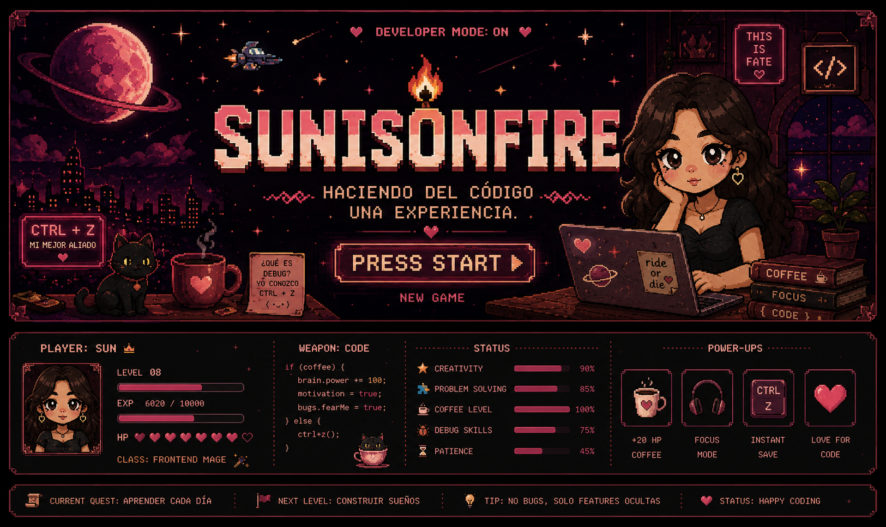
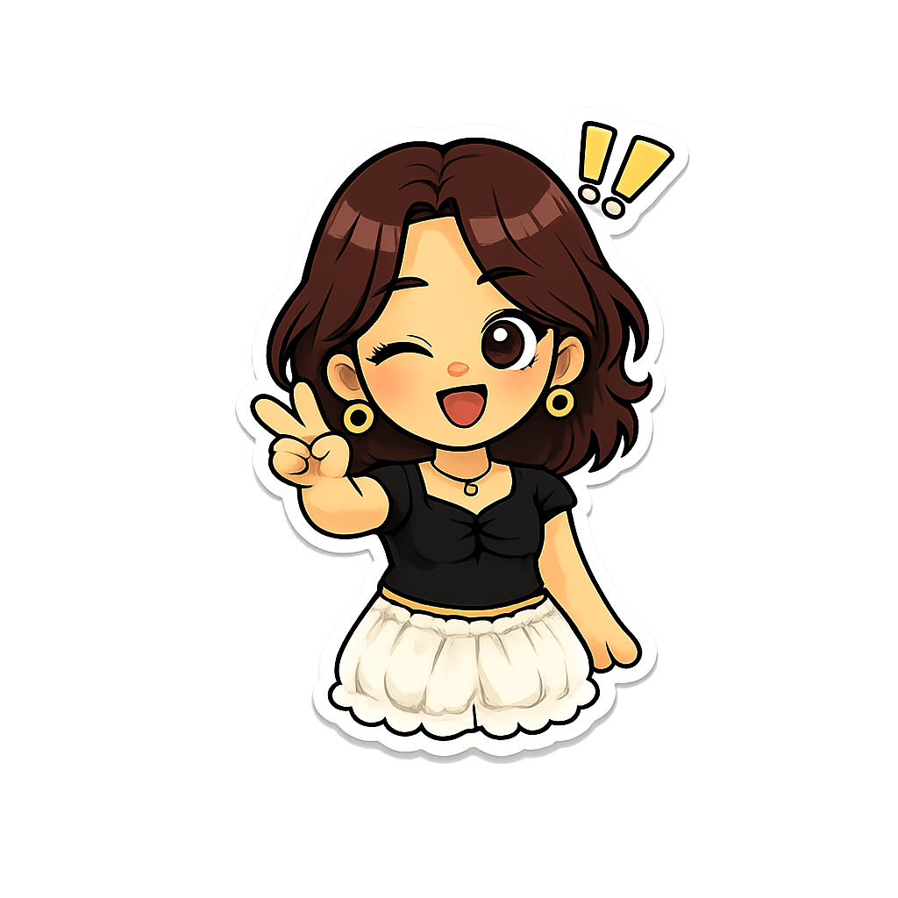

<!-- ====================================================== -->
<!--                      🌄 BANNER                         -->
<!-- ====================================================== -->

<div align="center">



<br><br>


⠀⠀⠀⠀⠀⠀⠀⠀⠀⠀⠀⠀⠀⠀⠀⢠⠀⠀⠀⠀⠀⠀⠀⠀⠀⠀
⠀⠀⠀⠀⠀⠀⠀⠀⢡⠀⠀⠀⠀⠀⢀⠇⠀⠀⠀⠀⠀⠀⠀⠀⠀⠀
⠀⠀⠀⣀⠀⠀⠀⠀⠀⢱⡀⠀⠀⠀⡜⠀⠀⠀⠀⠀⠀⠀⠀⠀⠀⠀
⠀⠀⠀⠈⠳⣄⡀⠀⠀⠀⠓⠀⠀⠀⠃⠀⠀⠀⡔⠁⠀⠀⠀⠀⠀⠀
⠀⠀⠀⠀⠀⠀⠉⠃⠀⢀⣠⠤⠤⣄⠀⠀⠀⠁⠀⠀⠀⠀⠀⠀⠀⠀
⠀⠀⠀⠀⠀⠀⠀⢀⡎⠁⢀⡀⠀⠀⢱⠉⢧⠀⠀⠀⠀⠀⠀⣀⡤⠄
⠈⠑⠒⠦⠤⠀⠀⢸⠀⠀⠀⠳⠤⠞⠁⠀⣸⠀⠀⠐⠚⠉⠉⠀⠀⠀
⠀⠀⠀⠀⠀⠀⠀⠀⢧⣀⠀⠀⠀⠀⣠⠞⠁⠀⠀⠀⠀⠀⠀⠀⠀⠀
⠀⠀⠀⠀⡠⠋⠀⠀⠀⠀⠉⠉⠉⠉⠀⠀⠀⢤⡀⠀⠀⠀⠀⠀⠀⠀
⠀⠀⡠⠊⠀⠀⠀⠀⠀⠀⠀⠀⡀⠀⠀⠀⠀⠀⠈⢳⠀⠀⠀⠀⠀⠀
⠀⠀⠀⠀⠀⠀⠀⠀⠀⠀⠀⠀⡇⠀⠀⠀⠀⠀⠀⠀⠙⠄⠀⠀⠀⠀
⠀⠀⠀⠀⠀⠀⠀⠀⠀⠀⠀⠀⡇⠀⠀⠀⠀⠀⠀⠀⠀⠀⠀⠀⠀⠀
⠀⠀⠀⠀⠀⠀⠀⠀⠀⠀⠀⠀⠁⠀⠀⠀⠀⠀⠀⠀⠀⠀⠀⠀⠀⠀
</div>

---

<table>

<tr>

<td width="35%" align="center">



<br><br>


</td>

<td width="65%">

# 👤 PLAYER INFO 𓆝 𓆟 𓆞

```yaml
name: Danna

username: sunisonfire

title: Software Developer in Training

class: Frontend Mage

level: Junior Developer

guild: Campuslands

location: 🇨🇴

current_mission:
  Build beautiful and functional web experiences.


favorite_weapon:
  Ctrl + Z

coffee_buff:
  +20 Productivity

hp:
  ██████████ 100%

mana:
  ████████░░ 80%

creativity:
  ██████████ MAX
```

> ### 💬 *"Haciendo del código una experiencia."*
<br>

> *No hay bugs... solo características inesperadas.*

</td>

</tr>

</table>

---
⠀⠀⠛⣹⣿⣿⣿⣿⣧⢸⣿⡿⣿⣿⡟⢼⣢⡴⡪⣔⣿⡾⢇⢿⡿⡟⣿⡝⣿⡝⢶⣫⢽⣥⣥⣴⠿⢀⡤⢊⠔⠁⠀⠀⠀⢀⠂⠁⠀⠀⠀⠠⡜⠀⡇⠀⠀⠀⠀⠀⠀⠀⠀⠀⠀⠀⠀⠀⠀⠀⠀⠀⠀⠀⠀⠀⠀⠀⠀⠀⠀⠀⠀⠀⠀⠀⠀⠀⠀
⠀⠀⠀⡘⣿⣿⣿⣿⣿⣟⢿⣿⣿⣷⣾⡿⠫⣺⣿⣿⣿⠇⣼⡛⠺⢏⣹⣷⣿⢻⣠⣶⡆⠤⣠⣔⠴⡫⠕⠁⠀⠀⠀⠀⠀⠘⡀⠀⠀⠀⠀⠀⠀⡸⠀⠀⠀⠀⠀⠀⠀⠀⠀⠈⠀⠁⠀⠁⠈⠀⠈⠀⠀⠀⠀⠉⠈⠀⠀⠀⠀⠀⠀⠀⠀⠀⠀⠀⠀
⠀⢰⣖⣪⡽⣿⣿⣿⣿⣿⣿⣾⣿⣿⣿⣿⠟⣙⣷⣟⡟⣾⣿⡿⣳⣾⣯⣿⣿⣯⣿⡿⠦⠒⠒⠂⠁⢐⠠⠀⠀⠀⠀⠀⠀⠀⠑⡤⣀⣀⣀⠠⠊⠀⠀⠀⠀⠀⠀⠀⠀⠀⠀⠀⢁⠀⠂⠠⢀⠠⠁⠠⠀⠄⠀⠄⠀⡁⢀⠀⡂⠄⠀⠀⠀⠀⠀⠀⠀
⢀⣀⠈⢁⣿⠛⢿⣟⣿⣿⢿⡿⣿⣿⠟⣖⣭⣨⡕⢻⢾⡯⠾⢿⣟⣿⡞⠋⠿⡋⠻⠔⠀⠀⠀⠀⠀⠀⠀⠀⠀⠀⠀⠀⠀⠀⠀⠐⠀⠀⠀⠀⠀⠀⠀⠀⠀⠀⠀⠐⠀⠀⠀⠈⡀⠄⠁⠂⠄⠀⠈⠀⠄⠈⠀⠀⠂⠀⠂⠀⠄⠀⠀⠠⢁⠀⠀⠀⠀
⢇⢸⣽⡸⣴⡻⢯⣿⣜⣿⣶⣾⣿⣯⡀⣯⣾⣿⣯⡫⣿⣿⣯⡉⣿⣿⣿⠌⠀⢂⠀⠀⠀⠀⠀⠀⠀⠀⠀⠀⠀⠀⠀⠀⠀⠀⠀⠀⠀⠀⠀⠀⠀⠀⠀⠀⠀⠀⠀⠀⠀⠀⠀⠀⠀⠀⠈⠀⣠⠴⠒⠋⠉⠩⠍⠓⠒⠤⣄⠁⡀⠈⠀⠀⠀⠀⠀⠀⠀
⠀⠈⠁⠠⢸⣿⣯⡘⣿⣿⣿⣠⣿⣷⣾⣿⣧⡿⣿⣷⡝⢿⣷⣝⢹⣧⣷⣿⢿⣿⠋⢅⠠⠄⠀⠀⠀⠀⠀⠀⠀⠀⠀⠀⠀⠀⠀⠀⠀⠀⠀⠀⠀⠀⠀⠀⠈⠀⢀⠀⠠⠁⠐⢀⠂⠀⡦⠊⢀⠐⠀⣠⡴⣖⣲⠦⠤⣀⠨⠙⢦⠀⠈⠠⠀⠀⠄⠀⠀
⠀⠀⠀⢏⠉⠫⢭⢴⠫⣿⣿⣿⣽⣿⣻⡿⣿⣥⣹⣻⣧⣶⣶⢖⡅⢯⣘⢿⣟⠁⣁⠈⠀⠀⠀⠀⠀⠀⠀⠀⠀⠀⠀⠀⠀⠀⠂⠀⠔⠀⠀⠂⢄⠀⠀⠀⠀⠠⠀⢂⠁⠈⠠⠀⢈⡞⠀⠐⡀⠈⠊⠉⠑⠉⠀⠀⡐⠀⠑⢌⠈⢷⠀⠁⠠⠁⢂⠀⠀
⠀⠀⣠⡶⡻⠷⢎⣴⣿⣿⡟⣿⢾⣷⡿⢋⣤⡿⠛⠛⠻⠿⠖⣹⣷⣻⢿⣷⣿⡄⠠⠀⠀⠀⠀⠀⠀⠀⠀⠀⠀⠀⠀⠀⠀⠀⠀⠁⠀⡀⠀⠀⠀⠠⠀⠀⠀⠀⠂⠀⠀⠀⠀⠄⡸⠀⠀⠀⠀⠀⠡⠀⢄⢂⠀⠁⠀⠀⠀⢀⢣⠈⣇⠀⠀⠀⠀⠀⠀
⠀⠀⣿⡝⠀⢠⡟⢋⣟⣿⡧⣟⠿⠿⡇⢿⡟⣂⠀⠈⠱⠀⠀⢻⣿⡿⠀⠈⠉⠃⠠⠀⠀⠀⠀⠀⠀⠀⠀⠀⠀⠀⠀⠀⠀⠀⠀⠂⠀⠠⠄⠀⠀⠀⠀⠀⠀⠀⠠⠀⠀⡀⠂⠀⣇⠀⠀⠁⠀⠄⠀⡀⠀⠄⠂⠁⠀⠄⠐⡀⠀⡇⡏⣟⢦⠀⠀⠀⠀
⠈⠀⢻⣶⣅⣈⣻⣿⢿⣫⣽⢆⠠⣂⠤⠊⢙⠛⢊⠋⠄⠀⠀⠀⠋⠀⠀⠀⠀⠀⠐⠀⠀⠀⠀⠀⠀⠀⠀⠀⢀⠀⡄⠀⠄⠄⠄⣀⠂⠄⠈⠄⠠⠀⠐⠄⠀⠈⠠⠀⠂⠄⢀⣐⠸⡄⠐⠠⠁⡀⠂⠀⠁⠂⣀⣤⡇⡘⠀⠠⠊⡄⡇⠙⢇⣣⠀⠀⠀
⠀⠀⠀⢈⠉⡉⣭⡴⢾⡬⡦⠉⡁⠂⠆⠠⠁⠀⠀⠀⠀⠁⠀⠀⠀⠀⠀⠀⠀⠀⠀⠀⠀⠀⠀⠀⠀⠠⠀⢀⠡⠈⠀⠀⠀⠀⠠⠀⠐⢀⠁⠐⠀⠀⡈⠀⠘⠀⠁⠂⢀⠈⢠⠉⡈⠘⢬⡂⠀⠀⠀⠀⠀⢠⣛⠟⠁⡐⠈⡐⢀⣧⠁⠀⠀⢰⠀⠀⠀
⠀⠀⠀⠀⠁⢀⡳⠞⢡⠞⠀⡇⠄⠒⠈⠀⠀⠀⠀⠀⠀⠀⠀⠀⠀⠠⠀⠀⠀⠂⠀⠀⠀⠀⠀⠀⠀⠠⢁⠢⠀⠀⠀⠀⠀⠀⠀⠀⠈⠀⠂⠀⡀⢀⠀⠁⠀⢈⠀⠀⠈⠀⠀⡁⡀⠡⠐⢨⠚⠯⠵⠄⠒⠉⢡⢐⣀⡀⠂⠀⣜⠎⠀⠀⠀⢸⠀⠀⠀
⠀⠀⠀⣠⠔⠋⢠⠜⠁⠨⠖⠁⣈⠂⠀⠀⠀⠀⠀⠀⠀⠀⠀⠀⠀⠀⠄⠂⢈⡀⠀⠀⠀⠀⠀⠀⡀⠅⠂⡀⠄⡁⠈⠀⠀⡀⠠⢀⠁⠠⠀⡁⠀⠆⠈⡠⠂⠂⠈⢀⠀⠂⡀⠠⠐⠌⠀⡆⡐⠀⠄⠂⠀⠀⣰⣯⣦⠙⡆⣼⠋⠀⠀⠀⣠⠏⠀⠀⠀
⠀⢀⠜⠁⢈⡔⡣⣶⡀⠀⠀⠐⠀⠀⠀⠀⠀⠀⠀⠀⠀⠀⠀⠀⢀⠀⠀⠌⠀⠀⠀⠠⠐⠀⠁⠀⠀⠈⠄⢀⠄⠀⢁⠄⠀⡐⠀⠄⠈⠀⡐⠐⠌⠀⡊⠄⠂⠈⠀⠄⠀⠃⢀⠡⠈⠀⠄⡇⠄⠰⠀⢂⡴⠞⠉⠙⢷⣠⠗⡁⡀⠀⣀⡾⠃⢀⠀⠀⠀
⠀⠈⠀⢀⡾⠀⠉⢉⢠⠐⠒⠂⢄⡀⢀⠀⠀⠀⠀⠀⠀⠀⠀⠄⠀⠀⠄⠀⠁⡀⠀⠀⠀⠀⠀⠀⠀⠄⠠⠁⠌⠀⡀⠄⠂⠈⠀⠀⠌⠐⢀⠡⠐⠁⡀⠐⢀⠈⢁⠈⠁⡁⠠⢀⠁⠌⠠⠘⣌⢄⠥⣸⣁⣄⣺⣇⡾⠃⠠⢐⣠⠞⠋⢀⠂⠀⠀⠀⠀
⠀⠰⢀⠸⡇⠀⠀⡾⠃⠀⠀⠀⠀⠑⡐⠂⢀⠀⠀⠀⠀⡀⠁⠠⡀⢂⠠⠑⢀⠠⠀⠀⢂⠀⡐⠀⠠⢀⠈⡐⢈⠤⠀⠐⡉⡀⠈⢄⠌⡐⠁⡂⠘⠀⠠⠐⡀⠠⠂⢈⠄⡠⠁⣂⡈⠤⠄⣂⡈⠫⣄⢻⠁⢛⡷⠉⠄⣢⡴⠛⠁⠌⠠⠐⡀⠀⠀⠀⠀
⠀⠀⠙⢣⢣⠀⠀⠀⠀⠂⠀⠀⠀⠀⡇⠀⠀⠀⠀⢀⠠⠀⢀⠀⠐⠂⡀⠌⠀⠠⠀⠀⠄⡐⠀⠁⠂⠠⠐⢈⠀⠢⢸⢀⠄⠁⡠⢀⠠⠈⠄⠠⣈⠁⠂⢁⣀⠁⠌⢀⡢⠒⠅⠂⢀⠂⠄⢠⣾⠛⢏⢻⣶⠋⣠⣷⣟⢑⡠⠐⠉⠠⠁⠔⠀⠔⠀⠀⠀
⠀⠀⠀⠈⢆⠑⢄⡀⠠⣤⠄⠀⢀⡜⠀⠀⢀⠀⠀⠀⠐⠀⠀⠄⠈⠀⠠⢀⠄⠂⠉⠀⠄⠈⠄⡂⠌⠐⢀⠂⡁⣢⣾⣆⠠⢁⠐⡈⠄⡁⢢⠩⠜⢓⠻⢟⡛⢷⣶⡋⠄⣉⠄⡈⠀⠌⠐⠌⢿⣦⣴⢯⣼⡿⢛⢟⠘⡆⣀⢀⠥⠁⠈⠄⠁⠂⡁⠂⠀
⠀⠀⠀⠀⠀⠑⠢⠤⢉⠀⠤⠔⠉⠀⠀⠀⠀⡀⠀⡠⠂⡁⠈⡀⠢⠀⡠⠀⠠⠐⢀⠩⠨⣁⠠⠐⠠⢁⠢⢰⣾⡿⣿⣻⡆⠄⢂⠰⠀⣔⡥⢁⠊⢰⠠⢉⡟⣾⣿⣷⢀⢛⣶⣶⣶⠟⣉⡙⣶⣿⣶⣿⢺⡃⢅⣢⣾⣧⣤⣴⣤⣬⣐⠀⠁⠀⠀⠀⠀
⠀⠀⡀⠀⠀⠀⠀⠀⠀⠀⠀⠀⠀⠀⠀⠀⠀⠐⡀⡀⠐⠐⡐⠀⠄⠁⠀⢄⠐⢈⠐⠨⠄⢹⣿⣷⣶⣦⣄⢻⣿⢳⣿⣟⣿⠈⠄⣐⡁⠂⠒⠏⡊⠤⠨⢁⣾⣿⡷⡟⠠⣨⣯⠽⣿⢷⣶⠗⠎⣿⡻⣳⣵⣿⣿⡿⠛⡉⢉⠉⠛⢿⣻⣷⡄⠀⠀⠀⠀
⡀⠀⡁⠀⠀⠀⠀⠀⠀⠀⠀⠀⠀⠀⠀⠀⠀⠀⢁⠁⠀⠀⠡⠀⠄⠂⠐⡈⠄⡌⠐⡀⢠⢸⣿⡿⣿⣿⣿⣜⣿⠸⣿⣿⡟⣠⣶⣿⣷⣶⣤⣂⣁⣀⣶⣾⡿⠯⠓⣑⣴⣿⣿⣶⣿⣾⣯⣴⣠⣿⣳⣿⣿⣿⢏⠁⠄⠡⠌⠢⡀⠈⣿⡽⣳⠀⠀⠀⠀
⠀⠀⠀⠀⠀⠀⠀⠀⠀⠀⠀⠀⠀⠀⠀⠀⠀⠀⠀⠂⠑⠄⠀⠡⡐⠈⡠⠐⡀⠆⣡⣐⡀⡈⢿⣷⣍⠻⣿⣿⡜⠆⢿⡟⠼⢋⣭⣵⣿⣿⣿⣿⡽⣿⠞⣺⢢⢰⣾⣿⣿⣟⣿⣿⣽⣻⣽⣿⣿⣿⣿⣿⡿⢏⡠⠲⠬⠉⠉⠐⠠⡀⣿⡼⣏⠇⠀⠀⠀
⠀⠀⠀⠀⠀⠀⠀⠀⠀⠀⠀⠀⢀⠀⠀⠀⠀⠀⠁⠀⠀⠐⠈⠔⡀⠠⡀⡔⠠⢘⠩⡘⠡⠐⣢⣝⣛⣳⠦⠍⠹⢢⡈⢢⣾⣿⣿⣿⡿⠟⣩⣟⣴⡁⠗⣹⢻⣿⣿⣿⣾⣟⣿⣾⣿⣽⣿⣿⣿⣿⣿⣽⣹⣷⠾⠛⠛⣶⣜⠀⢀⣼⣯⠷⡽⠀⠀⠀⠀
⠀⠀⠂⠀⠀⠀⠀⠀⠀⠀⠔⠈⠀⢀⠠⠄⠐⠂⠐⠈⢐⠐⠀⠄⢒⠁⣀⠠⣚⡃⠂⠒⣡⣿⡿⣛⣯⣯⣏⣄⣿⣂⡠⢳⣦⣦⣴⣄⡲⢉⢿⡯⣿⣿⣞⢸⣺⣿⣿⣷⣿⣿⣯⣿⣾⣿⣟⣯⡿⣿⣿⣿⣿⢋⢸⣾⣿⣿⣿⣟⢯⣿⡣⣟⠁⠀⡀⠢⠄
⠁⠀⠁⠀⠀⠀⠀⠀⠈⠀⢀⠀⠂⠁⠀⠀⠀⠀⠀⠀⠀⡀⢂⠈⠐⠈⡀⢁⠺⢪⣀⣴⣿⣿⣿⣿⣿⣿⠟⣫⢋⣿⣎⢧⡛⢿⣿⣿⣿⣶⡹⣷⣿⣟⣿⡞⡞⣿⣯⣿⣿⣾⣿⣿⣽⡿⡋⢼⣿⣿⣯⣿⣿⢋⠌⡻⣿⡿⣏⣧⠊⠁⠡⠆⡘⠰⢈⠁⠀
⠀⠀⠀⠀⠀⠀⠀⠀⠀⠀⠀⠀⠀⠀⠀⠀⠀⠀⠀⠀⠐⡄⣈⠠⢁⠂⡐⢊⠠⠄⡉⠋⢍⢙⢛⠛⠋⢡⣾⡇⣾⣿⣿⡈⢿⣶⣭⣿⣿⣿⢯⡸⢿⣟⣿⣿⡹⡹⣿⣿⠋⢦⣤⣿⣿⣥⣼⣤⣿⣿⡿⢿⣽⣿⣰⢿⣻⢙⢿⣟⡌⣡⡴⠶⢷⡓⠿⡃⠀
⠀⠀⠄⠀⠀⠀⠀⠀⠌⠀⠀⠀⠀⠀⠀⠀⠀⠀⠀⠀⠁⡠⢀⠆⡁⠒⠄⢂⠐⡰⢀⠁⠎⠰⠈⡠⡌⢸⣿⣏⣿⣿⣿⠍⣣⣙⣛⡿⢯⣭⠭⣵⣎⣙⣿⣿⣷⡹⡝⣿⠘⡤⣩⣿⣿⠿⠿⣿⡿⣿⣿⣦⡜⣿⣿⣙⣽⡳⡆⢣⢳⡏⢸⣹⣃⡇⠀⢱⠀
⠂⠀⠂⠀⠀⠀⠀⠐⠀⠀⠀⠀⠀⠀⠀⠀⠀⠀⠀⠀⠰⢀⠁⠢⠀⠉⡐⣈⠐⢠⡠⢈⡘⠖⠳⡼⢔⠡⢹⣿⣿⣿⠯⣛⣲⡭⣋⣭⣯⣭⣿⣝⠀⢈⡯⠽⣿⡿⢝⣾⠩⢰⣿⣿⣿⣳⣷⣭⣼⣷⣿⣿⣷⣾⡟⣷⢋⢰⠸⣽⣾⠯⠀⠉⠩⠶⠶⠃⠀
⠀⠀⠀⠀⠀⠀⠀⢀⠀⠀⠀⠀⠀⠀⣀⠀⠀⠀⡀⠐⡀⢂⠠⠃⢌⠐⡈⠄⠾⡉⣿⡿⣦⡿⣿⣇⣺⣷⡿⢚⣿⣷⣿⣿⢫⣾⠟⣩⣶⣿⠿⣛⣽⢗⣚⡒⢦⣉⢗⣯⣷⣿⣿⣿⣿⣿⣿⣿⣿⣿⣿⣿⣿⣷⣿⣿⣿⢦⡖⡇⣿⢈⣀⣄⠁⠀⠀⠀⠀
⠀⠀⡀⠀⠀⠀⠀⠠⢀⣀⣀⣀⣀⠘⢃⠀⡀⠒⠄⠁⠠⠅⢂⡑⠂⣡⠂⣑⣤⣶⢽⣿⢍⣻⢟⢟⣵⣵⢳⣿⣿⣿⡿⢣⢾⡷⣽⣿⡟⢡⣞⢿⣷⣿⣿⠏⡆⣏⣿⣾⣿⣿⣿⣿⣿⣿⣿⣿⣿⣿⣿⣿⣿⣿⣿⣿⣿⣿⡟⣬⡷⢻⣩⣫⠓⣄⠢⡀⠄
⡀⠀⠀⠀⠀⢀⡤⠊⠥⠀⠀⠀⠀⠉⠳⢔⢐⠈⠐⠀⠀⠈⠢⢀⠅⠤⠁⡈⢹⣿⣿⣒⠰⡿⣷⣿⣿⣿⣼⠿⣟⠛⠳⣮⣿⡿⣿⡿⢾⣿⡝⢦⡙⢿⣯⣬⣾⢿⣿⡿⠿⢛⣋⣭⣽⣕⣛⠿⣿⣿⣿⣿⣿⣿⣿⣿⣿⣯⣿⡾⡭⡜⣛⠍⠿⢣⢁⠁⠀
⠀⠀⠀⠀⡰⠋⠀⠀⠀⠁⠄⠀⠄⠀⠀⠀⢣⠈⡰⠀⢠⠀⠄⠀⠨⡅⠆⠁⣼⣿⣾⡟⡽⢫⣿⣿⡿⣹⡿⡪⢥⣷⢄⡂⠙⣳⡿⠡⣽⣿⣿⣷⣽⣖⣮⣭⢩⠍⣦⣴⣿⣿⣿⣿⣿⣿⣿⣿⣦⡙⢿⣿⣿⣿⣿⣿⣿⣿⣿⣋⠥⠖⡰⠈⠉⠱⡠⠀⠀
⠀⠀⠀⡼⠁⠀⢀⡀⠀⠀⠈⠐⠠⢠⠀⢀⠂⡇⠄⡐⡀⠡⠠⠁⠣⡌⢅⠨⣉⡵⣪⣴⡟⣿⢹⢏⢹⣽⣇⣷⢸⠿⠎⠛⠽⣟⢀⠇⣾⣿⣿⣿⣿⢿⡿⠛⣠⣾⣿⣿⢿⡛⣫⣿⣭⡛⣿⣿⣿⣿⡌⣿⣿⣿⣿⣿⣿⣿⣟⡆⣿⣇⠀⠀⠀⠈⠀⠀⠀
⠀⠀⢀⡇⠀⢠⢿⡄⠀⠡⡀⠀⠀⠁⡘⠀⢄⠇⢐⡴⠊⢉⠩⠉⠅⠚⣥⠞⣡⣟⣷⣥⣇⢸⣾⣿⣼⢿⠿⢯⢣⣶⣿⢶⣦⠈⢦⡼⣿⣿⣿⣛⠳⡎⡠⢚⢩⣭⡯⡗⢡⣾⣿⣿⣿⣿⢸⣿⣿⣿⡇⠸⣿⣻⣿⣞⣯⣽⣟⣾⡿⣿⣈⣀⠀⠀⠀⠀⠀
⠀⠀⠀⡇⡀⣟⡿⠁⠀⠀⠐⠐⠠⢈⣤⢖⡏⠌⣘⣌⡇⠀⢂⢁⣾⠾⣙⣟⢗⣟⣀⢈⣿⣿⡹⠿⡞⣻⣻⣿⣿⣿⢿⣿⣾⡇⣼⣿⣸⠟⠋⠁⢩⡜⣰⡵⡋⠉⢪⠇⢼⣿⣿⣿⣻⣷⣿⣿⣿⣿⡇⠀⣟⣿⣿⣿⣿⣷⣿⡿⡻⣽⣾⠿⠋⠀⠀⠀⠀
⠀⠀⠀⢧⠀⠘⡀⠀⢄⠀⠎⡈⠤⠾⠑⠉⠄⠲⡏⢯⠗⠈⣠⣞⣩⢴⣾⠗⠺⢿⣤⣿⡏⢎⠻⣯⣷⣷⣽⢿⣽⢛⢾⣭⣽⣼⣟⡻⠋⠀⣠⣴⡿⠯⣅⡮⣀⣀⢜⢇⠀⠻⣿⣿⣿⣿⣿⣟⡿⠋⠀⣸⣾⣷⣿⣿⣽⣯⣯⡶⡿⣿⣿⡆⡰⠋⠈⠀⠀
⡀⠀⠀⠈⢦⠁⠱⡀⠀⠈⠰⢀⠂⠄⠃⡌⢈⠠⠙⠶⢶⡾⣳⡟⣤⣟⠯⣷⠌⠄⢪⣿⠛⠛⠿⣽⣿⣿⣿⣿⣣⣼⣛⣝⠋⠟⣉⠠⣴⣻⣄⡟⡝⠙⡌⣮⣁⣨⢳⠭⣆⠀⠀⠉⠉⠉⠉⠁⠀⢀⣴⣿⣿⣿⣾⣷⣻⡽⣟⡿⠣⠌⡍⠗⡅⠀⠀⠀⠀
⠄⠀⠀⠀⠈⠳⣄⡈⠒⠬⣁⠂⠠⠁⠂⣀⡠⢔⠦⠋⢁⢀⠼⣶⠛⢟⣟⠈⡐⠰⣿⣿⣧⣀⣼⣿⠟⠉⣡⣟⣶⡿⠉⣴⣾⣿⣧⡜⢚⡹⡿⠷⣽⡇⣷⠟⠛⠺⡻⣤⠼⣱⣤⣀⣀⡀⣀⣤⣶⣿⣽⣻⣿⡿⣽⡽⣷⢿⡟⠦⡑⢊⠔⡱⢠⠀⠀⠀⠀
⠀⠀⠀⠀⠀⠀⠀⠉⠓⠲⢦⣬⡭⢅⠓⠂⠩⠐⠈⡐⢠⣠⢞⠡⠉⢉⠠⠐⠈⠐⠈⢻⡿⣿⢿⡶⣶⢟⣻⣜⠎⢷⣈⣻⣿⣿⣯⠘⣂⢿⡝⡦⣆⢃⢙⣠⢐⣴⠛⠗⢩⠭⣉⠿⣛⡧⣿⣿⢻⣿⢿⣝⢷⢫⡷⣽⣻⢻⣷⣰⢇⠣⡘⠤⢃⡑⠈⠀⠀
⡀⢀⡀⠀⠀⠀⠀⠀⠀⠀⠈⠻⣝⡃⡀⠁⠂⠡⣂⡤⠞⠁⠄⠂⠈⠄⠂⠁⠀⠁⠀⠀⠉⠛⠯⠷⠽⠎⠛⡁⠀⠈⠛⠻⠛⠫⠊⠁⣸⣿⡇⠀⠃⠚⢋⢎⠩⠘⠄⠠⠊⠉⢂⠂⠄⣃⠘⣞⡍⠼⠸⠦⠞⣛⡽⠞⠜⠒⠊⡗⠒⠉⠀⠉⠀⠘⠈⠀⠀


---

<div align="center">

## ⭐ CURRENT QUEST `⎚⩊⎚´ -✧ ⭐

> **Learning something new every single day.**


</div>

---

<!-- ====================================================== -->
<!--                    🎒 INVENTORY                        -->
<!-- ====================================================== -->

# 🎒 INVENTORY ˃ 𖥦 ˂

> **Every adventurer needs the right equipment before starting a quest.**

<div align="center">

| Item | Description |
|------|-------------|
| 🗡 **HTML Sword** | Gives structure to every project. |
| 🛡 **CSS Shield** | Protects layouts with responsive design and styling. |
| 🏹 **JavaScript Bow** | Adds interactivity and dynamic behavior. |
| 🧪 **Python Potion** | Used to solve problems through logic and automation. |
| 📚 **SQL Tome** | Stores and manages valuable information. |
| 📜 **Git Scroll** | Keeps every version of the adventure safe. |
| 💎 **GitHub Crystal** | Home of every completed quest. |
| 🧭 **Scrum Compass** | Helps the team reach the objective. |

</div>

<br>

<div align="center">

### ⚔ Equipped Technologies 𖦹 ´ ᯅ ` 𖦹


</div>

---

<!-- ====================================================== -->
<!--                   🌳 SKILL TREE                        -->
<!-- ====================================================== -->

# 🌳 SKILL TREE ദ്ദി •⩊• )

```text
                     FRONTEND
        ─────────────────────────────
        HTML           ● ● ● ● ●
        CSS            ● ● ● ● ○
        JavaScript     ● ● ● ○ ○


                     BACKEND
        ─────────────────────────────
        Python         ● ● ● ○ ○


                     DATABASES
        ─────────────────────────────
        SQL            ● ● ○ ○ ○


                     TOOLS
        ─────────────────────────────
        Git            ● ● ● ● ○
        GitHub         ● ● ● ● ○
        Scrum          ● ● ● ○ ○
```

> **Stay Still**

---

<!-- ====================================================== -->
<!--                  📊 PLAYER STATS                       -->
<!-- ====================================================== -->

# 📊 PLAYER STATS ૮ ˶´ ᵕˋ ˶ა

| Attribute | Level |
|-----------|-------|
| ❤️ Creativity | ██████████ 100% |
| 🧠 Problem Solving | █████████░ 90% |
| 🎨 UI Design | █████████░ 90% |
| 📚 Continuous Learning | ██████████ 100% |
| 🤝 Teamwork | ████████░░ 80% |
| 🚀 Adaptability | █████████░ 90% |
| ☕ Coffee Energy | ██████████ ∞ |

---

<div align="center">

### 📈 EXPERIENCE BAR 𖦹ࡇ𖦹

```text
Level 08 ─────────────────────────────── Level 09

███████████████████░░░░░░░░░░░░░░░░ 45%

Current Mission:
Keep learning, keep building, keep improving.
```

</div>

---

<!-- ====================================================== -->
<!--                    🗺 QUEST LOG                        -->
<!-- ====================================================== -->

# 🗺 QUEST LOG

> **Completed quests have shaped the developer I am today. Every project unlocked new skills, challenges and experience points.**

<table>
<tr>

<td width="50%" align="center">

### 🍰 Delicias del Ayer

*A nostalgic bakery website.*

🧩 Built as a product catalog with an interactive shopping cart and review notebook.

**Reward**
+ HTML
+ CSS
+ JavaScript

<a href="https://github.com/sunisonfire/delicias-del-ayer">📂 Repository</a>

</td>

<td width="50%" align="center">


### 🚌 KidRoute

*A smarter way to organize school transportation.*

🧩 Designed to improve route management and provide a clear interface for users.

**Reward**
+ UI Design
+ JavaScript
+ Responsive Design

<a href="https://github.com/sunisonfire/KidRoute">📂 Repository</a>

</td>

</tr>

<tr>

<td width="50%" align="center">


### 🐶 HappyPaws

*A platform to help pets find a home.*

🧩 Focused on creating an intuitive experience that connects pets with future families.

**Reward**
+ HTML
+ CSS
+ UX Thinking

<a href="https://github.com/sunisonfire/HappyPaws">📂 Repository</a>

</td>

<td width="50%" align="center">


### 💼 Portfolio

*My digital home.*

🧩 A creative portfolio where I showcase my projects, skills and personality through interactive design.

**Reward**
+ Creativity
+ Responsive Design
+ Animation

<a href="https://github.com/sunisonfire/Portafolio">📂 Repository</a>

</td>

</tr>
</table>

---
⠀⠀⠀⠀⠀⠀⠀⠀⠀⠀⠀⠀⠀⠀⣤⠖⠋⠓⠋⠳⣄⠀⠀⠀⠀⠀⠀⠀⠀⠀⠀⠀⠀⠀⠀⠀⠀⠀⠀⠀⠀⠀⠀⠀⠀⠀⠀⠀⠀⠀
⠀⠀⠀⠀⠀⠀⠀⠀⠀⠀⠀⠀⠀⣘⠃⠀⠀⠀⠀⠀⠀⢋⡄⠀⠀⠀⠀⠀⠀⠀⠀⠀⠀⠀⠀⠀⠀⠀⠀⠀⠀⠀⠀⠀⠀⠀⠀⠀⠀⠀
⠀⠀⠀⠀⠀⠀⠀⠀⢀⠀⠀⠀⠀⢸⠅⠀⠀⢻⡄⠀⠀⠀⢹⡀⠀⠀⠀⠀⠀⠀⠀⠀⠀⠀⠀⠀⠀⠀⠀⠀⠀⠀⠀⠀⠀⠀⠀⠀⠀⠀
⠀⠀⢀⣀⡄⣄⣀⠸⣟⣿⠃⢀⡀⠈⠩⢢⣤⠬⠁⢀⣀⣀⠼⠃⢾⣿⣿⠀⠀⠀⠀⠀⠀⠀⠀⠀⠀⠀⠀⠀⠀⠀⠀⠀⠀⠀⠀⠀⠀⠀
⢀⡜⠋⠀⠀⠀⠀⠘⣄⠁⣚⠁⢉⡆⠀⠈⠈⢀⡴⣪⣽⠟⡶⢤⣌⠈⠁⠀⠀⠀⠀⠀⠀⠀⠀⠀⠀⠀⠀⠀⠀⠀⠀⠀⠀⠀⠀⠀⠀⠀
⢾⠀⠤⣤⣄⡀⠀⠀⠀⢦⣇⠀⠙⠁⠀⠀⢀⡽⠚⠉⠀⣐⠌⠀⠘⢸⡄⠀⠀⠀⠀⠀⠀⠀⠀⠀⠀⠀⠀⠀⠀⠀⠀⠀⠀⠀⠀⠀⠀⠀
⠹⢂⠀⠀⡻⠓⠀⠀⠀⠸⠅⠀⠀⠀⠀⣠⠞⠀⠀⢀⡖⠁⠀⢿⠀⢀⡟⠀⠀⠀⠀⠀⠀⠀⠀⠀⠀⠀⠀⠀⠀⠀⠀⠀⠀⠀⠀⠀⠀⠀
⠀⠀⠉⠉⠁⠀⠀⠀⠀⣨⠁⠀⠀⢀⡾⡍⠀⢀⠶⠋⠀⠀⠀⠀⠉⠁⠀⠀⠀⠀⠀⠀⠀⠀⠀⠀⠀⠀⠀⠀⠀⠀⠀⠀⠀⠀⠀⠀⠀⠀
⠀⠀⠀⠀⠀⠀⠀⠀⢠⠅⠀⣀⣴⡿⣟⡠⠼⠉⠀⠀⠀⠒⠙⠙⣆⠀⠀⠀⠀⠀⠀⠀⠀⠀⠀⠀⠀⠀⠀⠀⠀⠀⠀⠀⠀⠀⠀⠀⠀⠀
⠀⠀⠀⠀⠀⠀⠀⠀⠋⢀⣀⠋⢏⠄⠧⠁⠦⣤⣀⣰⡶⠒⠲⠠⠛⠀⣀⠀⠀⠀⠀⠀⠀⠀⠀⠀⠀⠀⠀⠀⠀⠀⠀⠀⠀⠀⠀⠀⠀⠀
⠀⠀⠀⠀⠀⠀⣠⠁⠢⠆⠉⠀⠀⠀⠀⠀⠀⠀⢩⢽⠁⠦⢀⠀⠀⢿⣿⡇⠀⠀⠀⠀⠀⠀⠀⠀⠀⠀⠀⠀⠀⠀⠀⠀⠀⠀⠀⠀⠀⠀
⠀⠀⠀⠀⠀⡰⡤⠉⠀⠀⠀⠀⠀⠀⠀⠀⠀⠀⠀⠘⠷⣆⠈⢋⢄⠀⠈⠀⠀⠀⠀⠀⠀⠀⠀⠀⠀⠀⠀⠀⠀⠀⠀⠀⠀⠀⠀⠀⠀⠀
⠀⠀⠀⠀⠒⠋⠀⠀⠀⠀⠀⠀⠀⠀⠀⢀⢀⡀⠀⠀⠀⢰⣆⠀⠴⢫⡀⠀⠀⠀⠀⠀⠀⠀⠀⠀⠀⠀⠀⠀⠀⠀⠀⠀⠀⠀⠀⠀⠀⠀
⠀⠀⠀⠀⠀⠀⠀⠀⠀⠀⠀⠀⠀⠀⠰⠌⠀⠁⡯⠀⠀⢬⣱⠀⠸⠴⠑⢠⠀⠀⣄⣀⠀⠀⠀⠀⠀⠀⠀⠀⠀⠀⠀⠀⠀⠀⠀⠀⠀⠀
⠀⠀⠀⠀⠀⠀⠀⠀⠀⠀⠀⠀⠀⠀⣽⡀⠀⠀⠀⠀⣤⠂⣾⠁⡨⢈⠀⢐⣻⡙⠀⠈⣖⠀⣀⣀⠀⠀⠀⠀⠀⣤⠶⠒⠒⠲⠦⣤⡀⠀
⠀⠀⠀⠀⠀⠀⠀⠀⠀⠀⠀⠀⠀⠀⠥⠀⠀⠀⢀⣾⣦⢿⡁⠀⠨⠡⠀⢸⡇⠹⣄⢰⡋⠘⠯⠉⢷⡀⠀⠀⣾⡇⢀⣄⠀⠀⠀⠈⢳⣶
⠀⠀⠀⠀⠀⠀⠀⠀⠀⠀⠀⠀⠀⠀⠀⠙⠻⠐⠳⠀⢁⡞⠁⠀⠀⠑⡀⢀⡘⡿⣟⡇⠀⠀⠀⠀⡼⠁⠀⠀⠘⠾⠐⠃⠀⠀⠀⠀⢰⣿
⠀⠀⠀⠀⠀⠀⠀⠀⠀⠀⠀⠀⠀⠀⠀⠀⠀⠀⠀⠀⢰⠄⠀⠀⢀⠀⠀⠀⠰⠂⢉⣶⣧⡀⣠⡾⠁⠀⠀⠀⠀⠀⠀⠀⠀⠀⠀⠀⣠⣿
⠀⠀⠀⠀⠀⠀⠀⠀⠀⠀⠀⠀⠀⠀⠀⠀⠀⠀⠀⠀⢈⡅⠀⠀⢿⣹⣒⠀⠀⠀⠋⠻⠞⠙⣟⡆⠀⠀⠀⠀⠀⠀⠀⠀⠀⠀⣀⢲⠍⠀
⠀⠀⠀⠀⠀⠀⠀⠀⠀⠀⠀⠀⠀⠀⠀⠀⠀⠀⠀⠀⠀⠰⣄⡀⠀⣜⠃⠀⠀⠀⠀⠀⠀⠀⠀⠩⣏⡲⠆⣰⣄⣠⡄⣔⠦⠛⠉⠁⠀⠀
⠀⠀⠀⠀⠀⠀⠀⠀⠀⠀⠀⠀⠀⠀⠀⠀⠀⠀⠀⠀⠀⠀⠈⠈⠉⠀⠀⠀⠀⠀⠀⠀⠀⠀⠀⠀⠀⣙⡶⣀⠀⠀⢀⣤⢤⡄⠀⠀⠀⠀
⠀⠀⠀⠀⠀⠀⠀⠀⠀⠀⠀⠀⠀⠀⠀⠀⠀⠀⠀⠀⠀⠀⠀⠀⠀⠀⠀⠀⠀⠀⠀⠀⠀⠀⠀⠀⠀⠀⢳⡁⠳⣄⠀⠻⠟⠋⠀⠀⠀⠀
⠀⠀⠀⠀⠀⠀⠀⠀⠀⠀⠀⠀⠀⠀⠀⠀⠀⠀⠀⠀⠀⠀⠀⠀⠀⠀⠀⠀⠀⠀⠀⠀⠀⠀⠀⠀⣠⣄⣄⣖⠀⠀⠓⣁⠀⠀⠀⠀⠀⠀
⠀⠀⠀⠀⠀⠀⠀⠀⠀⠀⠀⠀⠀⠀⠀⠀⠀⠀⠀⠀⠀⠀⠀⠀⠀⠀⠀⠀⠀⠠⡾⠘⢳⡄⠀⢼⣿⠉⢸⣋⠗⠀⠀⣅⡀⠀⠀⠀⠀⠀
⠀⠀⠀⠀⠀⠀⠀⠀⠀⠀⠀⠀⠀⠀⠀⠀⠀⠀⠀⠀⠀⠀⠀⠀⠀⠀⠀⠀⠀⠈⣧⠈⠁⠀⠀⠘⣷⣖⠏⠀⠀⠀⢠⣬⠀⠀⠀⠀⠀⠀
⠀⠀⠀⠀⠀⠀⠀⠀⠀⠀⠀⠀⠀⠀⠀⠀⠀⠀⠀⠀⠀⠀⠀⠀⠀⠀⠀⠀⠀⠀⠀⠃⡤⣤⢤⣤⠞⠙⠲⠤⣤⣴⠜⠀⠀⠀⠀⠀⠀⠀
<!-- ====================================================== -->
<!--                  🏆 ACHIEVEMENTS                       -->
<!-- ====================================================== -->

# 🏆 ACHIEVEMENTS  ˶ᵔ ᵕ ᵔ˶ 

<div align="center">

| Achievement | Status |
|-------------|:------:|
| 🎒 First Portfolio Created | ✅ |
| 🌐 First Responsive Website | ✅ |
| 🤖 Built AI-Assisted Projects | ✅ |
| 📚 Learning Every Day | ✅ |
| ☕ Coffee Powered Development | ✅ |
| 🎨 Creative Interface Designer | ✅ |
| 🧩 Problem Solver | ✅ |
| 🚀 Ready For New Quests | 🔄 |

</div>

---

<!-- ====================================================== -->
<!--                 📈 GITHUB PROGRESS                     -->
<!-- ====================================================== -->

#  ✎﹏﹏GITHUB PROGRESS

<div align="center">


</div>

<br>

<div align="center">


</div>

<br>

⠀⠀⠀⠀⢀⣤⠤⣄⠀⠀⠀⠀⣠⠤⣄⠀⠀⠀
⠀⠀⠀⢠⠞⠀⠀⠈⢷⠀⠀⡜⠃⠀⠈⢳⠀⠀
⠀⠀⠀⣾⠀⠀⠀⠀⠘⡇⢰⠅⠀⠀⠀⠸⡇⠀
⠀⠀⠀⣿⠀⠀⠀⠀⠀⡇⣾⠀⠀⠀⠀⢸⠃⠀
⠀⠀⠀⢹⡀⠀⠀⠀⠀⡇⣿⠀⠀⠀⠀⡾⠀⠀
⠀⠀⠀⠸⡇⠀⠀⠀⠀⠷⠿⠀⠀⠀⢰⠇⠀⠀
⠀⢀⡴⠛⠃⠀⠀⠀⠀⠀⠀⠀⠀⠀⠘⢶⡀⠀
⢰⠟⠀⠀⠀⠀⠀⠀⠀⠀⠀⠀⠀⠀⠀⠀⢻⡄
⣿⠁⠀⠀⠀⠀⠀⠀⠀⠀⠀⠀⠀⠀⠀⠀⠀⣷
⢹⠀⠀⠀⢰⡆⠀⠀⠀⠀⠀⠀⢀⣄⠀⠀⠀⡟
⠈⢧⡀⠀⠀⠀⠀⠀⢄⡀⣀⠀⠀⠁⠀⠀⣸⠃
⠀⠈⠻⢦⣀⠀⠀⠀⠚⠙⠂⠀⠀⠀⣀⡴⠋⠀
⠀⠀⠀⠀⠈⠉⠓⠒⠲⠶⠶⠒⠒⠋⠁⠀⠀⠀

---

<!-- ====================================================== -->
<!--                 PLAYER PROGRESSION                     -->
<!-- ====================================================== -->

<div align="center">

## ✨ NEXT LEVEL OBJECTIVES

```text
☐ Learn React

☐ Learn Node.js

☐ Build Full Stack Applications

☐ Contribute to Open Source

☐ Master Database Design

☐ Land my first developer role
```

*"The adventure has only just begun..."*

</div>

---

<!-- ====================================================== -->
<!--                   🎵 NOW PLAYING                       -->
<!-- ====================================================== -->

# 🎵 NOW PLAYING

<div align="center">


</div>


---

<!-- ====================================================== -->
<!--                    📬 MAILBOX                          -->
<!-- ====================================================== -->

# 📬 MAILBOX

> **Need another adventurer for your next quest? Let's connect.**

<div align="center">

<a href="https://github.com/sunisonfire">

</a>

<a href="https://www.linkedin.com/in/danna-t%C3%A9llez-8a8811402/">

</a>

<a href="mailto:TU-CORREO">

</a>

<a href="https://TU-PORTAFOLIO.vercel.app">

</a>

</div>

---

<!-- ====================================================== -->
<!--                 🌌 VISITOR COUNTER                     -->
<!-- ====================================================== -->

<div align="center">

### 🌌 Travelers who visited this world


</div>

---

<!-- ====================================================== -->
<!--                     ❤️ FINAL MESSAGE                   -->
<!-- ====================================================== -->

<div align="center">


<br><br>

## ✨ Thanks for visiting my little universe.

*"Every line of code is another step in this adventure."*

**May your commits be clean, your bugs be few, and your coffee never run out. ☕**

<br>


</div>

---

<div align="center">

### 🚀 Game Status

```text
Player............. Online

Current Mission.... Become a Full Stack Developer

XP................ Growing every day

Next Quest......... Build something amazing.

Save Game.......... ✔ Successful
```

---

⭐ If you enjoyed exploring this profile, don't forget to leave a star on your favorite project.

</div>
⠀⠀⠀⠀⠀⠀⠀⠀⠀⠀⠀⠀⠀⠀⠀⠀⠀⠀⠀⠀⠀⠀⠀⠀⣤⠴⢤⡀⠀⠀⠀⠀⠀⠀⠀⠀⠀⠀⠀⠀⠀⠀⠀⠀⠀⠀⠀
⠀⠀⠀⠀⠀⠀⠀⠀⠀⠀⠀⠀⠀⠀⠀⠀⠀⠀⠀⣠⢾⣛⡆⠈⡏⠰⠶⠃⠀⠀⠀⠀⠀⠀⠀⠀⠀⠀⠀⠀⠀⠀⠀⠀⠀⠀⠀
⠀⠀⠀⠀⠀⠀⠀⠀⠀⠀⠀⠀⠀⠀⠀⠀⠀⠀⢦⣿⣄⣉⣁⣤⠽⣦⣤⡶⠶⣤⣄⠀⠀⠀⠀⠀⠀⠀⠀⠀⠀⠀⠀⠀⠀⠀⠀
⠀⠀⠀⠀⠀⠀⠀⠀⠀⠀⠀⠀⠀⠀⠀⠀⠀⠀⠉⠚⠹⡉⢃⣴⠟⠉⠀⠀⠀⠀⠉⠻⣦⡀⠀⠀⠀⠀⠀⠀⠀⠀⠀⠀⠀⠀⠀
⠀⠀⠀⠀⠀⠀⠀⠀⠀⠀⠀⠀⠀⠀⠀⠀⠀⠀⠀⠀⣤⢡⡿⠁⠀⠀⠀⠀⠀⠀⠀⠀⠈⢷⡄⠀⠀⠀⠀⠀⠀⠀⠀⠀⠀⠀⠀
⠀⠀⠀⠀⠀⠀⠀⠀⠀⠀⠀⠀⠀⠀⠀⠀⠀⠀⠀⢀⡂⣿⡇⠀⠀⠀⠀⣠⣤⣀⠀⠀⠀⠘⣇⠀⠀⠀⠀⠀⠀⠀⠀⠀⠀⠀⠀
⠀⠀⠀⠀⠀⠀⠀⠀⠀⠀⠀⠀⠀⠀⠀⠀⠀⠀⠀⠀⠁⢻⣷⠀⠀⠀⠀⢯⡉⣿⡆⠀⠀⣰⡇⠀⢀⣀⢤⠀⠀⠀⠀⠀⠀⠀⠀
⠀⠀⠀⠀⠀⠀⠀⠀⠀⠀⠀⠀⠀⠀⠀⠀⠀⠀⠀⠀⠀⠘⢿⣧⣀⠀⠀⢀⣴⡟⠀⠀⣰⣿⡷⢏⡭⠔⠹⠀⠀⠀⠀⠀⠀⠀⠀
⠀⠀⠀⠀⠀⠀⠀⠀⠀⢀⡀⠀⠀⠀⠀⠀⠀⠀⠀⠀⠀⠀⠀⠙⠛⠿⠿⠟⠋⠀⢀⣼⣿⣿⣿⠿⣭⡉⢛⡃⠀⠀⠀⠀⠀⠀⠀
⠀⠀⠀⠀⠀⣀⣤⠶⠿⣟⣟⣝⡷⣲⢤⣀⠀⠀⠀⠀⠀⠀⢠⠀⠀⠀⠀⠀⠀⣠⣾⡿⠃⠹⡟⢖⠢⠽⠦⠁⠀⠀⠀⠀⠀⠀⠀
⠀⠀⢀⣴⠞⠁⠀⠀⠀⠀⠀⠉⠙⢦⣕⡯⣷⣄⠀⠀⠠⣴⠋⢓⡶⠂⠀⢀⣼⣿⠟⠁⠀⠀⠈⠺⡄⠋⣀⣰⣀⠀⠀⠀⠀⠀⠀
⠀⣠⠟⠁⠀⠀⠀⠀⠀⠀⠀⠀⠀⠀⠙⢯⣒⢭⣦⠀⠀⢸⠕⠦⠇⠀⣤⣿⡿⠃⣠⠴⠶⠶⣤⡀⠀⠀⠼⠿⡏⠀⠀⠀⠀⠀⠀
⢀⡏⠀⠀⠀⠀⠀⠀⠀⠀⠀⠀⠀⠀⠀⠈⠻⣝⡫⢧⠀⠀⠀⠀⣠⣾⡿⠉⠀⢸⠁⢀⣀⠀⠈⣷⠀⠀⠀⠀⠀⠀⠀⠀⠀⠀⠀
⣼⠁⠀⠀⠀⠀⣠⣶⣿⣿⣷⣦⡀⠀⠀⠀⠀⠙⡮⣛⡆⠀⠀⣰⣿⡏⢐⡀⠀⠸⣦⣀⣨⠇⠒⣸⣀⣀⣄⣀⡀⠀⠀⠀⠀⠀⠀
⢹⠆⠀⠀⠀⢠⣿⡿⠃⠀⠀⠉⢻⡄⠀⠀⠀⠀⠙⣗⢿⠀⣸⡟⡙⢷⡈⢠⠀⡀⠈⠉⣁⠘⣠⠟⠉⠉⠙⢿⣿⡆⠀⠀⠀⠀⠀
⠘⣇⠀⠀⠀⠈⢿⡇⠀⢲⠀⠀⠀⢻⡀⠀⢤⣴⡀⠹⣽⣴⡿⣁⠀⠈⠻⣦⣤⣥⣌⣡⡤⠞⠁⠀⣰⠛⠆⣸⣿⡇⠀⠀⠀⠀⠀
⠀⢻⡄⠀⠀⠀⠀⠉⠙⠉⠀⠀⠀⢸⠀⠀⠚⠻⠁⠀⢿⣿⢣⢀⡤⠶⠲⢮⣍⡉⠉⠁⠀⣤⠀⠀⠘⢿⣿⡿⠏⠀⠀⠀⠀⠀⠀
⠀⠀⢻⣄⠀⠀⠀⠀⠀⠀⠀⠀⣰⠋⠀⡀⠀⠀⠀⠀⢸⣿⣰⠏⢀⡴⢶⡄⢸⡇⠀⢖⠚⠉⠓⣲⠆⠀⠀⠀⠀⠀⠀⠀⠀⠀⠀
⠀⠀⠀⠙⠷⣦⣄⣀⣀⣠⣴⠾⠁⠀⢰⣕⢲⣪⡉⠅⣾⣿⡟⠀⠈⠳⠭⠵⠋⠀⠀⣼⣁⢄⣸⠀⠀⠀⠀⠀⠀⠀⠀⠀⠀⠀⠀
⠀⠀⠀⠀⠀⠀⠉⠉⠉⠉⠀⠀⠀⢤⡼⠉⢹⡣⣉⠀⣿⣿⡇⠀⠀⢠⣴⠶⢦⡀⠀⠁⠀⠀⣙⡂⠀⠀⠀⠀⠀⠀⠀⠀⠀⠀⠀
⠀⠀⠀⠀⠀⠀⠀⠀⠀⠀⠀⠀⠀⠀⢸⡔⠟⡛⡀⡆⣿⡟⣷⠀⠀⣿⣇⣲⠈⡿⢀⣴⣾⣿⠿⠿⣿⣷⣦⡀⠀⠀⠀⠀⠀⠀⠀
⠀⠀⠀⠀⠀⠀⠀⠀⢰⡀⡷⣰⣇⡴⠠⠜⠀⠀⠀⠀⣿⡇⡘⣷⣄⠀⠙⣉⠞⢡⣿⡟⠁⠀⠀⠀⠀⠈⠻⣿⣆⠀⠀⠀⠀⠀⠀
⠀⠀⠀⠀⠀⠀⠀⠠⣤⣯⣷⣧⠿⠵⠶⠶⣤⣄⡀⠀⢻⣇⠡⡌⠻⣏⠉⠁⠀⢺⣿⠀⠀⢀⣶⣶⣤⠀⠀⠘⣿⡀⠀⠀⠀⠀⠀
⠀⠀⠀⠀⠀⠀⠀⠠⢾⡿⡋⠗⠈⠃⠈⠁⠰⠉⡻⢶⣜⣿⢘⠂⣠⣌⣷⡀⠀⢸⣿⡆⠀⠈⠧⠄⢸⡇⠀⠀⣹⠇⠀⠀⠀⠀⠀
⠀⠀⠀⠀⠀⠀⠀⣰⠏⠄⠁⠀⠀⠀⠀⠀⠀⠀⠁⠈⠙⢿⣏⠰⡏⣬⣿⢻⡀⠀⠻⣿⣄⠀⠀⣠⠞⠀⠀⢠⡟⠀⠀⠀⠀⠀⠀
⠀⠀⠀⠀⠀⠀⢰⡏⠴⠀⠀⠀⠀⢀⣠⣀⣀⠀⠀⠀⠀⠈⢻⣧⡙⢦⣤⡾⠁⠀⠀⠈⠙⠛⠋⠁⠀⠀⣠⡞⠁⠀⠀⠀⠀⠀⠀
⠀⠀⠀⠀⠀⠀⠸⢿⡀⠀⠀⠀⣰⠋⠁⠀⠉⠙⢦⠀⠀⠀⠀⢻⣟⢦⣄⡀⠀⠀⠀⠀⠀⠀⠀⣀⣤⠾⠋⠀⠀⠀⠀⠀⠀⠀⠀
⠀⠀⠀⠀⠀⠀⢹⡹⣇⠀⠀⠘⡇⠀⠀⠖⡆⠀⠘⣧⠀⠀⠀⠀⠻⣎⢿⠹⠳⢲⡲⢶⠶⠾⠛⠉⣁⣠⠀⠀⠀⠀⠀⠀⠀⠀⠀
⠀⠀⠀⠀⠀⠀⠸⣎⡹⣧⡀⠀⠻⣦⣤⠴⠃⠀⢰⠏⠀⣤⣀⣴⠀⠙⣧⡱⡀⢠⡾⢟⣛⡓⣆⠀⠿⣿⠛⠁⠀⠀⠀⠀⠀⠀⠀
⠀⠀⠀⠀⠀⠀⠀⠱⣊⠜⣻⣶⣄⣀⠀⠀⠀⣀⠟⠠⣔⣊⠁⣶⣄⠀⠈⢷⣅⢸⠅⢸⣓⣃⣼⠀⠀⠈⠀⠀⠀⠀⠀⠀⠀⠀⠀
⠀⠀⠀⠀⠀⠀⠀⠀⠙⢮⡞⡜⡝⡝⡟⡯⠟⠁⠀⠀⠀⠈⠿⠀⠀⠀⠀⠀⠹⣶⡳⢤⣹⣯⡥⠴⠶⠶⠦⣄⠀⠀⠀⠀⠀⠀⠀
⠀⠀⠀⠀⠀⠀⠀⠀⠀⠀⠉⠉⠉⠉⠁⠀⠀⠀⠀⠀⠀⠀⠀⠀⣠⣤⣤⣀⠀⠈⠻⣦⡀⠀⠀⡞⣙⣷⠀⢈⡆⠀⠀⣀⠀⠀⠀
⠀⠀⠀⠀⠀⠀⠀⠀⠀⠀⠀⠀⠀⠀⠀⠀⠀⠀⠀⠀⠀⠀⢠⣿⠏⣤⢈⣿⠀⠀⠀⠈⠳⣄⠈⣷⣈⣉⣠⡼⢡⡾⠛⠉⠙⢳⡀
⠀⠀⠀⠀⠀⠀⠀⠀⠀⠀⠀⠀⠀⠀⠀⠀⠀⠀⠀⠀⠀⠀⢸⣿⣄⠈⠉⠁⢀⣀⣤⣶⣶⣾⣷⣌⠙⠋⠁⠀⣿⠀⢤⡀⠀⠀⣷
⠀⠀⠀⠀⠀⠀⠀⠀⠀⠀⠀⠀⠀⠀⠀⠀⠀⠀⠀⠀⠀⠀⠀⠉⠛⠻⠿⠛⠛⠉⠁⡼⠋⢠⠨⠍⡳⢄⡀⠀⠘⠻⠛⠁⠀⣰⡿
⠀⠀⠀⠀⠀⠀⠀⠀⠀⠀⠀⠀⠀⠀⠀⠀⠀⠀⠀⠀⠀⠀⠀⠀⠀⠀⠀⠀⠀⠀⢸⡇⣔⡒⡞⡀⠁⠰⠙⡲⢦⣤⣤⣤⣾⠿⠁
⠀⠀⠀⠀⠀⠀⠀⠀⠀⠀⠀⠀⠀⠀⠀⠀⠀⠀⠀⠀⠀⠀⠀⠀⠀⠀⠀⠀⠀⠀⠀⠑⠺⠞⠧⠁⠀⠀⠀⠁⠐⠉⠉⠉⠀⠀⠀